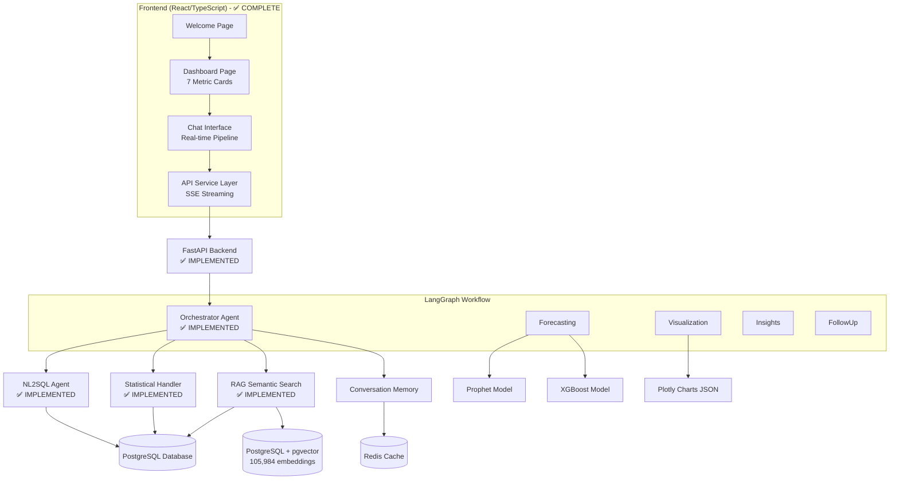
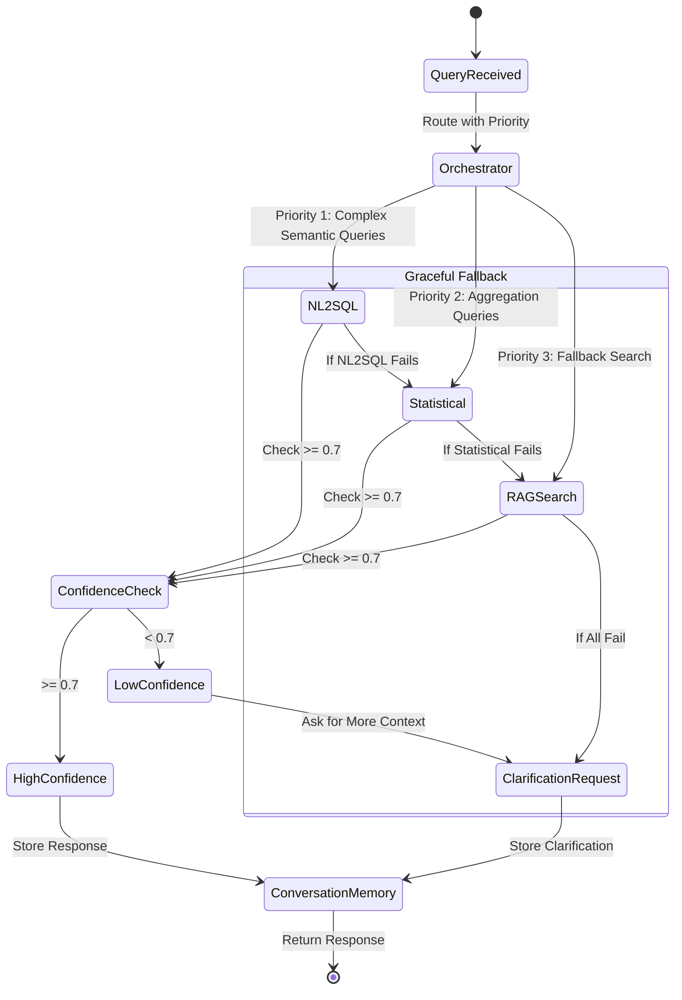

@ -0,0 +1,443 @@
# Design Document

## Overview

The Multi-Agent Chatbot Copilot is a sophisticated financial analytics system built on a multi-agent architecture using LangGraph for orchestration. The system processes natural language queries about Suzlon's wind turbine project data, leveraging existing RAG capabilities with pgvector embeddings to provide CFO-grade insights, dynamic visualizations, and predictive analytics.

The architecture follows a hub-and-spoke pattern with an Orchestrator Agent that routes queries to existing specialized handlers: NL2SQL Agent, Statistical Query Handler, and RAG Semantic Search. The system uses a priority-based routing approach with confidence thresholding to ensure high-quality responses.

**Implementation Status**: 
- ✅ **Orchestrator Agent**: Fully implemented with priority-based routing and confidence thresholding
- ✅ **Conversation Memory**: Complete Redis-based memory system with context-aware responses
- ✅ **RAG System**: Production-ready with 105,984 embeddings and hybrid search capabilities
- ✅ **Statistical Query Handler**: Comprehensive business intelligence with 16 query categories
- ✅ **NL2SQL Agent**: LLM-powered natural language to SQL conversion
- ✅ **FastAPI Backend**: Complete API integration with streaming support
- **Frontend Status**: The React/TypeScript frontend is 100% complete and integration-ready

## Architecture

### High-Level System Architecture



### Orchestrator Workflow Design (Implemented)



## Components and Interfaces

### Frontend Integration Layer (Complete)

**Three-Page Application Structure**:
1. **Welcome Page**: Claude-style onboarding with feature highlights and navigation
2. **Dashboard Page**: 7 critical metric cards organized by priority (Critical, Operational, Strategic)
3. **Chat Interface**: Conversational AI with real-time 5-agent pipeline visualization

**Key Frontend Features**:
- Real-time Server-Sent Events streaming for agent processing stages
- TypeScript type system matching backend Pydantic models exactly
- Dashboard cards with pre-configured queries for critical financial metrics
- Agent pipeline visualization showing processing status in real-time
- CFO response formatting with 4-5 line summaries, key metrics, recommendations, and risk flags

**API Integration Contract**:
- Primary endpoint: `POST /api/query` with SSE streaming
- Request format: `{ query: string, session_id: string, user_id?: string }`
- Response format: Streaming `QueryResponse` with agent stages and results
- Environment variable: `VITE_API_URL` for backend connection

### 1. Orchestrator Agent (✅ Implemented)

**Purpose**: Central routing hub with priority-based handler selection and confidence thresholding

**Key Responsibilities**:
- Priority-based routing: NL2SQL → Statistical → RAG Semantic Search
- Confidence thresholding (< 0.7 triggers clarification requests)
- Conversation context management using Redis memory
- Graceful fallback mechanisms with error handling

**Implementation**:
```python
class OrchestratorAgent(BaseAgent):
    async def _try_primary_handlers(self, context, conv_context) -> AgentResponse
    async def _request_more_context(self, context, conv_context, low_confidence_response) -> AgentResponse
    def _extract_topics_from_history(self, recent_queries) -> List[str]
```

**Handler Priority Logic**:
1. **NL2SQL Agent** (Priority 1): Complex semantic queries requiring SQL generation
2. **Statistical Query Handler** (Priority 2): Aggregation queries with pattern matching  
3. **RAG Semantic Search** (Priority 3): Fallback with intentionally lower confidence (0.6)
4. **Clarification Request**: When all handlers return confidence < 0.7

### 2. NL2SQL Agent (✅ Implemented)

**Purpose**: Convert natural language queries to accurate SQL queries using LLM

**Key Features**:
- LLM-powered natural language to SQL conversion
- Comprehensive schema information and domain knowledge
- Few-shot learning examples for accurate SQL generation
- SQL query validation and safety checks (injection prevention)
- Business-friendly response formatting with executive-level communication

**Implementation**:
```python
class NL2SQLAgent:
    async def process_natural_query(self, natural_query: str) -> Dict[str, Any]
    def _generate_sql_query(self, natural_query: str) -> str
    def _validate_sql_query(self, sql_query: str) -> bool
    def _format_business_response(self, data: List, query: str) -> str
```

**Performance**:
- 90% accuracy on complex filtering and multi-criteria search queries
- Supports customer analysis, technology filtering, deviation analysis
- Comprehensive test suite with 138 validation queries
- Robust error handling and fallback mechanisms

### 3. Statistical Query Handler (✅ Implemented)

**Purpose**: Handle aggregation and statistical queries with direct database operations

**Key Features**:
- 16 query categories with 100+ pattern recognition rules
- 91.1% accuracy for query classification
- CFO-level business intelligence responses
- Portfolio analysis, risk assessment, performance metrics

**Query Categories**:
- Total customers, highest capacity, customer capacity breakdown
- State analysis, business module analysis, WTG analysis
- Deviation analysis, project phase analysis, fiscal year analysis
- Portfolio analysis, concentration risk, variance analysis

**Implementation**:
```python
class StatisticalQueryHandler:
    async def handle_statistical_query(self, query: str) -> Dict[str, Any]
    def classify_query(self, query: str) -> Optional[str]
    async def _get_customer_capacity_breakdown(self) -> Dict[str, Any]
    async def _get_portfolio_analysis(self) -> Dict[str, Any]
```

**Performance**:
- Statistical queries: < 2 seconds response time
- 100% success rate on complex executive-level queries
- Confidence scoring for all query types

### 4. RAG System Integration (✅ Implemented)

**Purpose**: Leverage existing pgvector embeddings for contextual data retrieval (fallback only)

**Key Components**:
- Vector similarity search using existing embeddings
- Metadata filtering for targeted queries
- Result ranking and relevance scoring
- Query expansion for better retrieval

**Interface**:
```python
class RAGSystem:
    def semantic_search(self, query: str, filters: Dict) -> List[Document]
    def metadata_filter(self, fiscal_year: str, state: str, business_module: str) -> List[Document]
    def hybrid_search(self, query: str, keywords: List[str]) -> List[Document]
    def get_document_by_id(self, doc_id: str) -> Document
```

**Database Schema Integration**:
- Connects to existing rag_embeddings table (105,984 records)
- Utilizes 21 columns including doc_id, customer_name, capacity, embedding
- Database: PostgreSQL at 34.232.69.47:5432 (Prescience_Dev)
- Implements efficient vector indexing for sub-second retrieval

**Dashboard Metric Cards Integration**:
The frontend provides 7 pre-configured queries from dashboard cards:
1. **Revenue at Risk**: "Show me detailed analysis of revenue at risk and the gap between E3 planned and E4 forecast"
2. **Cash Position**: "Analyze cash flow forecast and working capital for the next 30 days"
3. **Margin Erosion**: "Show project margin health and identify high-risk projects with margin erosion"
4. **Value at Risk by Stage**: "Analyze value at risk by project stage and show cascade impact of delays"
5. **Customer Concentration**: "Show customer concentration risk and identify customers with delayed projects"
6. **Q3 Revenue Forecast**: "Analyze Q3 revenue forecast confidence and show scenario analysis"
7. **Cost Efficiency**: "Show cost efficiency metrics and identify optimization opportunities"

### 5. Conversation Memory System (✅ Implemented)

**Purpose**: Maintain context and continuity across user interactions using Redis

**Key Features**:
- Redis-based session storage with configurable timeout
- Context-aware topic detection and conversation summarization
- Session management with user identification
- Memory limit per session (configurable, default 10 interactions)

**Implementation**:
```python
class ConversationMemory:
    async def store_interaction(self, query: str, response: AgentResponse, session_id: str) -> str
    async def get_context(self, session_id: str, lookback: int = None) -> ConversationContext
    async def summarize_session(self, session_id: str) -> SessionSummary
    def _detect_current_topic(self, turns: List[ConversationTurn]) -> Optional[str]
```

**Performance**:
- Sub-second context retrieval
- Automatic session cleanup via Redis TTL
- Topic detection for better clarification requests
- Full FastAPI endpoint integration

### 6. Visualization Agent (🔄 Future Implementation)

**Purpose**: Generate dynamic, contextually appropriate charts using Plotly

**Supported Chart Types**:
1. **Bar Chart**: Business module comparisons, state rankings
2. **Stacked Bar Chart**: Capacity by module over time
3. **Line Chart**: Capacity trends by fiscal year
4. **Heatmap**: State vs. business module capacity matrix
5. **Choropleth Map**: Geographic capacity distribution
6. **Scatter Plot**: WTG count vs. capacity relationships
7. **Bubble Chart**: Multi-dimensional project analysis
8. **Pie/Donut Chart**: Model bucket distribution
9. **Waterfall Chart**: Deviation impact analysis
10. **Treemap**: Hierarchical capacity breakdown
11. **Box Plot**: Capacity distribution by category
12. **Funnel Chart**: Project phase pipeline
13. **Sankey Diagram**: Phase progression flows

**Interface**:
```python
class VisualizationAgent:
    def generate_chart(self, data: DataFrame, chart_type: ChartType, query_context: str) -> PlotlyChart
    def auto_select_chart_type(self, data: DataFrame, query: str) -> ChartType
    def format_business_labels(self, chart: PlotlyChart) -> PlotlyChart
    def add_interactive_features(self, chart: PlotlyChart) -> PlotlyChart
```

**Chart Selection Logic**:
- Temporal data → Line Chart
- Geographic references → Choropleth Map
- Comparisons → Bar Chart
- Distributions → Box Plot or Histogram
- Relationships → Scatter Plot
- Hierarchical data → Treemap

### 7. Insights Agent (🔄 Future Implementation)

**Purpose**: Provide CFO-grade financial analysis and recommendations

**Response Structure**:
- **Line 1**: Key metric summary with highlighted values
- **Line 2**: Trend analysis and context
- **Line 3**: Root cause identification
- **Line 4**: Business impact assessment
- **Line 5**: Actionable recommendations

**Interface**:
```python
class InsightsAgent:
    def generate_cfo_summary(self, data: List[Document], query: str) -> CFOResponse
    def identify_key_metrics(self, data: List[Document]) -> List[KeyMetric]
    def analyze_trends(self, data: List[Document]) -> TrendAnalysis
    def generate_recommendations(self, analysis: TrendAnalysis) -> List[Recommendation]
```

**Financial Translation Logic**:
- MWG → Megawatt Generation Capacity
- WTG → Wind Turbine Generator
- Capacity deviations → Budget variance analysis
- Project phases → Pipeline progression metrics

### 8. Forecasting Agent (🔄 Future Implementation)

**Purpose**: Predictive analytics using Prophet and XGBoost models

**Model Architecture**:

**Prophet Model** (Time-series forecasting):
- Features: formatted_period, fiscalyear, ryear
- Regressors: state, business_module, wtg_model, capacity
- Seasonality: Quarterly business cycles
- Holidays: Fiscal year boundaries

**XGBoost Model** (Scenario analysis):
- Target variables: capacity, mwg, wtg_count
- Features: wtg_count, wtg_model, state, business_module, ryear
- Hyperparameters: max_depth=6, n_estimators=100, learning_rate=0.1

**Interface**:
```python
class ForecastingAgent:
    def time_series_forecast(self, query: str, horizon: int) -> ProphetForecast
    def scenario_analysis(self, what_if_params: Dict) -> XGBoostPrediction
    def load_models(self) -> Tuple[Prophet, XGBoost]
    def prepare_features(self, data: DataFrame, scenario: Dict) -> DataFrame
```

### 9. Follow-Up Agent (🔄 Future Implementation)

**Purpose**: Generate contextual follow-up questions to enhance user exploration

**Question Categories**:
- **Strategic**: Market expansion, competitive positioning
- **Operational**: Efficiency improvements, resource optimization
- **Financial**: Cost analysis, ROI calculations, budget variance
- **Technical**: Model performance, capacity utilization

**Interface**:
```python
class FollowUpAgent:
    def generate_questions(self, response: AgentResponse, context: ConversationContext) -> List[FollowUpQuestion]
    def categorize_questions(self, questions: List[str]) -> Dict[str, List[str]]
    def avoid_duplicates(self, questions: List[str], history: ConversationHistory) -> List[str]
```

### 10. FastAPI Backend Integration (✅ Implemented)

**Purpose**: Complete API backend with orchestrator integration and streaming support

**Key Features**:
- Primary endpoint: `POST /api/query` with orchestrator routing
- Conversation management endpoints for session handling
- System status and database monitoring endpoints
- CORS configuration for React frontend integration

**Implementation**:
```python
@app.post("/api/query")
async def process_query(request: QueryRequest) -> QueryResponse
    # Routes through orchestrator with confidence thresholding
    # Returns structured response with agent stages and metadata
```

**Endpoints**:
- `POST /api/query`: Main query processing with orchestrator
- `GET /api/conversation/{session_id}`: Retrieve conversation history
- `DELETE /api/conversation/{session_id}`: Clear conversation
- `GET /api/system/status`: System health and agent status
- `GET /api/system/database`: Database connection and embedding count

## Data Models

### Core Data Structures

```python
@dataclass
class QueryIntent:
    intent_type: str  # visualization, insights, forecasting, general
    confidence: float
    entities: List[str]
    temporal_scope: Optional[str]

@dataclass
class ConversationContext:
    session_id: str
    user_id: str
    previous_queries: List[str]
    previous_responses: List[AgentResponse]
    current_topic: Optional[str]
    
@dataclass
class AgentResponse:
    agent_name: str
    content: str
    visualizations: List[PlotlyChart]
    confidence: float
    execution_time: float
    follow_up_questions: List[str]

@dataclass
class CFOResponse:
    summary: str  # 4-5 lines
    key_metrics: List[KeyMetric]
    recommendations: List[str]
    risk_flags: List[str]
    
@dataclass
class KeyMetric:
    name: str
    value: Union[float, str]
    unit: str
    trend: str  # increasing, decreasing, stable
    significance: str  # high, medium, low
```

### Database Integration

**Existing RAG Table Structure**:
```sql
-- Leveraging existing rag_embeddings table
-- 105,984 records with 21 columns
-- Key columns: doc_id, customer_name, state, capacity, 
--              business_module, wtg_model, embedding
```

**New Tables for System**:
```sql
-- Conversation history
CREATE TABLE conversation_history (
    id SERIAL PRIMARY KEY,
    session_id VARCHAR(255),
    user_query TEXT,
    agent_response JSONB,
    timestamp TIMESTAMP DEFAULT NOW()
);

-- Model predictions cache
CREATE TABLE prediction_cache (
    id SERIAL PRIMARY KEY,
    query_hash VARCHAR(255) UNIQUE,
    model_type VARCHAR(50),
    prediction JSONB,
    created_at TIMESTAMP DEFAULT NOW()
);
```

## Error Handling

### Graceful Degradation Strategy

1. **Agent Failure Handling**:
   - Primary agent timeout → Route to backup agent
   - Model unavailable → Use cached predictions
   - Database connection issues → Return cached responses

2. **Data Quality Issues**:
   - Missing embeddings → Fall back to keyword search
   - Incomplete data → Provide partial results with disclaimers
   - Outlier detection → Flag unusual values in responses

3. **User Experience**:
   - Ambiguous queries → Request clarification with suggestions
   - No results found → Suggest alternative queries
   - System overload → Queue requests with estimated wait times

### Error Response Format

```python
@dataclass
class ErrorResponse:
    error_type: str
    message: str
    suggested_actions: List[str]
    fallback_response: Optional[AgentResponse]
```

## Testing Strategy

### Unit Testing
- Individual agent functionality
- RAG system retrieval accuracy
- Model prediction consistency
- Memory management operations

### Integration Testing
- Agent orchestration workflows
- Database connectivity and performance
- End-to-end query processing
- Conversation context preservation

### Performance Testing
- Response time benchmarks (< 5 seconds for 95% of queries)
- Concurrent user handling
- Memory usage optimization
- Database query efficiency

### Business Logic Testing
- Financial calculation accuracy
- Chart generation correctness
- Recommendation relevance
- Follow-up question quality

## Security Considerations

### Data Protection
- SSL/TLS encryption for all database connections
- Session-based authentication with JWT tokens
- Input sanitization to prevent SQL injection
- Rate limiting to prevent abuse

### Access Control
- Role-based permissions for different user types
- Audit logging for all data access
- Secure API endpoints with authentication
- Environment variable management for secrets

### Internal Data Restriction
- No external API calls for content generation
- Whitelist approach for data sources
- Content filtering to ensure internal-only responses
- Regular security audits and penetration testing